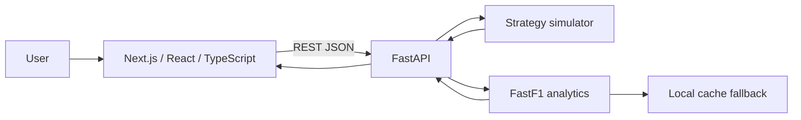

# Overtakr

**Formula 1 strategy intelligence — race simulation, driver storytelling and overtake analytics in one full-stack application.**

[](./frontend)
[](./frontend)
[](./backend)
[](./backend/Dockerfile)
[](./LICENSE)

> **Technical reviewer?** Start with the [60-second tour](#60-second-technical-tour), then see the [architecture notes](./docs/architecture.md).

---

## What Overtakr does

F1 strategy analysis is often spread across timing screens, static summaries and isolated data points. Overtakr brings several views of a race into one interactive product:

- **Strategy Lab** — compare multiple race strategies with adjustable pit windows, tyre profiles, pit-loss assumptions and weather risk.
- **Driver Digest** — turn race data into a concise per-driver story covering grid-to-finish movement, consistency and stint context.
- **Overtake Intelligence** — inspect lap-by-lap position changes and race movement hotspots.
- **Shareable scenarios** — reproduce a strategy configuration through URL-based scenario state.

The goal is not only to display F1 data, but to demonstrate an end-to-end engineering workflow: product UI, API design, simulation logic, data transformation, deployment configuration and graceful fallback behaviour.

---

## 60-second technical tour

| What to review | Where | What it demonstrates |
| --- | --- | --- |
| Main product UI | [`frontend/app/page.tsx`](./frontend/app/page.tsx) | React/Next.js UI engineering, product state and visualisation |
| Frontend dependencies | [`frontend/package.json`](./frontend/package.json) | Next.js, React, TypeScript, Recharts, Framer Motion and Zod |
| API layer | [`backend/main.py`](./backend/main.py) | FastAPI endpoints and request orchestration |
| Strategy engine | [`backend/simulator.py`](./backend/simulator.py) | Domain logic and simulation modelling |
| Race-data integration | [`backend/fastf1_utils.py`](./backend/fastf1_utils.py) | FastF1/Pandas ingestion, transformation and fallback handling |
| System design | [`docs/architecture.md`](./docs/architecture.md) | Architecture, trade-offs and scaling considerations |
| Deployment | [`docs/deployment.md`](./docs/deployment.md) | Vercel + Render/Fly + Docker deployment path |

---

## Architecture



### Frontend

- Next.js 15
- React 19
- TypeScript
- Recharts
- Framer Motion
- Zod
- Tailwind CSS

### Backend

- FastAPI
- Python
- Pandas
- FastF1

### Deployment

- Frontend: Vercel-ready
- Backend: Render/Fly-ready
- Backend container: Docker
- Environment-driven CORS configuration

For the reasoning behind these choices, see [`docs/architecture.md`](./docs/architecture.md).

---

## Engineering decisions

### Typed frontend contracts

The frontend models API data explicitly so race and simulation data have predictable shapes at the UI boundary rather than being passed around as loosely structured objects.

### Offline data fallback

Motorsport data services can be slow or unavailable during development and demos. Overtakr can fall back to local cached race data so a temporary external failure does not automatically make the product unusable.

### Reproducible scenario state

Strategy settings can be represented in shareable URLs, which makes a scenario easier to reproduce for demos, comparison and debugging.

### Deployment without hard-coded origins

CORS and frontend URLs are configured through environment variables, allowing local and hosted environments to use the same application code.

---

## API surface

```text
GET  /api/health
GET  /api/years
GET  /api/races?year=2024
GET  /api/drivers?year=2024&round=1
POST /api/simulate
GET  /api/driver-digest?year=2024&round=1&driver=VER
GET  /api/overtake-map?year=2024&round=1&driver=VER
```

---

## Local development

### Backend

```bash
cd backend
python3 -m venv .venv
source .venv/bin/activate
pip install -r requirements.txt
cp .env.example .env
uvicorn main:app --reload --port 8000
```

### Frontend

```bash
cd frontend
npm install
cp .env.example .env.local
npm run dev
```

Open `http://localhost:3000`.

---

## Environment variables

### Frontend — `frontend/.env.local`

```env
NEXT_PUBLIC_API_BASE_URL=http://localhost:8000
NEXT_PUBLIC_SITE_URL=http://localhost:3000
```

### Backend — `backend/.env`

```env
CORS_ALLOW_ORIGINS=http://localhost:3000,http://127.0.0.1:3000,https://your-vercel-domain.vercel.app
FRONTEND_URL=
```

---

## Deployment

Deployment configuration is already included:

- [`frontend/vercel.json`](./frontend/vercel.json)
- [`render.yaml`](./render.yaml)
- [`backend/fly.toml`](./backend/fly.toml)
- [`backend/Dockerfile`](./backend/Dockerfile)

See [`docs/deployment.md`](./docs/deployment.md) for the deployment walkthrough.
