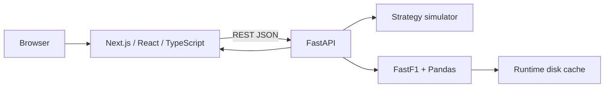

# Overtakr

[](https://github.com/Adel-Mtr/overtakr/actions/workflows/ci.yml)
[](./frontend)
[](./frontend)
[](./backend)
[](./compose.yaml)

**Formula 1 strategy intelligence: compare race strategies, inspect driver race stories and explore lap-by-lap position changes.**

Overtakr is a full-stack application built with a Next.js/TypeScript frontend and a FastAPI/Python analytics backend using FastF1 race data.

## Features

- **Strategy Lab** — compare up to six pit/tyre strategies against the same race baseline.
- **Pit-window radar** — rank potential stop windows using tyre-life, pit-loss and safety-car context.
- **Driver Digest** — summarize grid-to-finish movement, best lap, consistency and stint structure.
- **Position-change intelligence** — inspect lap-level position gains/losses and race movement hotspots.
- **Shareable scenarios** — encode the current race/strategy setup into a reproducible URL.
- **Runtime FastF1 cache** — first loads fetch race data; repeat loads reuse generated cache data.

> Overtakr's strategy engine is a heuristic comparison model intended for analysis and software demonstration. It is not a real-world race-team prediction model or betting tool.

---

## Quick start — Docker

### Requirements

- Docker with Docker Compose
- Internet access for the first load of a race that is not already cached

```bash
git clone --depth 1 https://github.com/Adel-Mtr/overtakr.git
cd overtakr
docker compose up --build
```

Alternatively, download the repository's current source ZIP from GitHub and run the same `docker compose up --build` command from the extracted folder.

Then open:

- App: **http://localhost:3000**
- API health: **http://localhost:8000/api/health**
- Interactive API docs: **http://localhost:8000/docs**

FastF1 cache data is stored in a Docker named volume. Stop the stack with:

```bash
docker compose down
```

To also delete cached race data:

```bash
docker compose down -v
```

---

## Local development

The repository is tested with **Node.js 22** and **Python 3.13**.

### 1. Backend

```bash
cd backend
python -m venv .venv
source .venv/bin/activate     # Windows: .venv\Scripts\activate
pip install -r requirements-dev.txt
cp .env.example .env
uvicorn main:app --reload --port 8000
```

### 2. Frontend

In a second terminal:

```bash
cd frontend
npm ci
cp .env.example .env.local
npm run dev
```

Open **http://localhost:3000**.

### Useful commands

From the repository root:

```bash
make test       # backend tests
make lint       # frontend ESLint
make typecheck  # TypeScript compiler check
make build      # production Next.js build
make docker-up  # Docker Compose stack
```

---

## Configuration

### Frontend

`frontend/.env.local`

```env
NEXT_PUBLIC_API_BASE_URL=http://localhost:8000
```

`NEXT_PUBLIC_API_BASE_URL` is embedded into the Next.js browser bundle at build time. Set it to the public backend URL before a production frontend build.

### Backend

`backend/.env`

```env
CORS_ALLOW_ORIGINS=http://localhost:3000,http://127.0.0.1:3000
FRONTEND_URL=
FASTF1_CACHE_DIR=ff1cache
```

- `CORS_ALLOW_ORIGINS` — comma-separated allowed browser origins.
- `FRONTEND_URL` — optional extra frontend origin.
- `FASTF1_CACHE_DIR` — runtime FastF1 cache path; generated cache data is intentionally ignored by Git.

---

## API

| Method | Endpoint | Purpose |
| --- | --- | --- |
| `GET` | `/` | Service metadata and API links |
| `GET` | `/api/health` | Health/version/cache status |
| `GET` | `/api/years` | Supported seasons |
| `GET` | `/api/races?year=2024` | Race schedule for a season |
| `GET` | `/api/drivers?year=2024&round=1` | Driver list/results for a race |
| `POST` | `/api/simulate` | Run strategy comparisons |
| `GET` | `/api/driver-digest?...` | Driver race summary |
| `GET` | `/api/overtake-map?...` | Lap-level position-change data |

Request validation rejects malformed pit-lap input, duplicate strategy names and unavailable driver selections with useful `422` responses.

---

## Architecture



The frontend owns product state and visualisation. The backend owns FastF1 loading, validation, race-data transformation and strategy modelling. FastF1 high-frequency telemetry is deliberately disabled because the current product only needs timing/results/weather/track-status data, reducing cold-load size and backend memory use.

See [`docs/architecture.md`](./docs/architecture.md) for more detail.

---

## Project structure

```text
overtakr/
├── .github/workflows/ci.yml
├── backend/
│   ├── main.py
│   ├── simulator.py
│   ├── fastf1_utils.py
│   ├── tests/
│   ├── Dockerfile
│   └── requirements*.txt
├── frontend/
│   ├── app/
│   ├── lib/api.ts
│   ├── Dockerfile
│   └── package.json
├── docs/
├── compose.yaml
├── Makefile
└── render.yaml
```

Generated FastF1 cache files, virtual environments, Node modules and build output are not committed.

---

## Quality checks

Every push/PR runs GitHub Actions for:

**Backend**

- dependency installation;
- pytest unit/API validation tests;
- Python bytecode compilation.

**Frontend**

- clean `npm ci` install;
- ESLint;
- TypeScript type checking;
- full Next.js production build.

**Containers**

- Docker Compose configuration validation;
- complete frontend and backend image builds.

The backend tests are designed not to download race data, so CI remains deterministic and does not depend on FastF1 availability.

---

## Deployment

Included deployment paths:

- **Frontend:** Vercel (`frontend/vercel.json`)
- **Backend:** Render (`render.yaml`)
- **Backend:** Fly.io (`backend/fly.toml` + Dockerfile)
- **Whole app locally/self-hosted:** Docker Compose (`compose.yaml`)

See [`docs/deployment.md`](./docs/deployment.md).

---

## Data/cache behavior

Overtakr does **not** commit downloaded race telemetry or HTTP cache databases. On the first request for a race, FastF1 may need to download and parse upstream data. Subsequent requests can reuse its runtime disk cache plus a small in-process session cache.

If the upstream data source is unavailable and the requested data has never been cached, the API returns a `502` with a user-safe message rather than exposing an internal traceback.

See [`docs/troubleshooting.md`](./docs/troubleshooting.md) if setup or race loading fails.

---

## License and disclaimer

Code in this repository is provided under the [MIT License](./LICENSE).

Overtakr is an independent project and is not affiliated with or endorsed by Formula 1, the FIA, any Formula 1 team, or FastF1. Formula 1 names and related marks belong to their respective owners.
