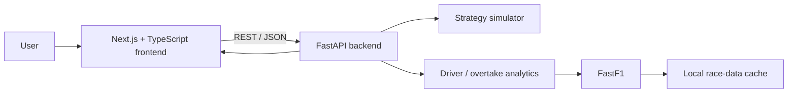

# Overtakr Architecture

This document gives reviewers a fast technical view of how Overtakr is structured and why the main engineering choices were made.

## System overview



The project is intentionally split into a frontend application and a data/analytics API. This keeps visual product concerns separate from race-data processing and simulation logic while still allowing both sides to evolve together in one repository.

## Frontend

**Location:** `frontend/`

Primary technologies:

- Next.js 15
- React 19
- TypeScript
- Recharts
- Framer Motion
- Zod
- Tailwind CSS

The frontend is responsible for:

- scenario configuration;
- user interaction and state;
- API requests;
- visual comparison of strategy results;
- race-story and overtake presentation;
- shareable scenario state.

The main product surface currently lives in `frontend/app/page.tsx`.

## Backend

**Location:** `backend/`

Primary technologies:

- FastAPI
- Python
- Pandas
- FastF1

Key responsibilities are separated into focused modules:

- `main.py` — HTTP/API boundary and endpoint orchestration;
- `simulator.py` — strategy simulation logic;
- `fastf1_utils.py` — race-session loading, transformation and analytics utilities;
- `ff1cache/` — local data used as a fallback when live data cannot be obtained reliably.

## Main request flow

A representative strategy workflow looks like this:

1. The user selects a season, race and strategy parameters in the Next.js application.
2. The frontend sends a typed JSON payload to the FastAPI service.
3. The backend loads or resolves the relevant race data.
4. Simulation and analytics functions transform the input into comparable strategy outputs.
5. The API returns structured JSON.
6. The frontend renders the result as leaderboards, cumulative-gap charts and strategy insights.

## Reliability considerations

### Offline race-data fallback

External motorsport data can be slow, unavailable or inconsistent during development and demos. The backend therefore supports local cached race data so the product still has a usable failure path when live loading is not available.

### Environment-driven CORS

Allowed frontend origins are configured through environment variables instead of hard-coding deployment domains into application logic. This allows local development and hosted frontend/backend deployments to use the same codebase.

### Reproducible scenarios

Scenario state can be represented in URLs, making a configuration easier to share and reproduce during review or debugging.

## Deployment model

The repository includes deployment configuration for a split architecture:

```text
Browser
  |
  v
Vercel / Next.js frontend
  |
  v
Render or Fly.io / FastAPI backend
  |
  v
FastF1 + local cache
```

Relevant files:

- `frontend/vercel.json`
- `render.yaml`
- `backend/fly.toml`
- `backend/Dockerfile`

See [`deployment.md`](./deployment.md) for deployment notes.

## Trade-offs and next improvements

The current architecture favours a clear, reviewable portfolio implementation over unnecessary infrastructure complexity. Reasonable next steps would include:

- automated frontend and backend test coverage;
- CI checks for linting, type safety and backend tests;
- stronger API schema generation between Python and TypeScript;
- persistent scenario storage;
- observability for slow or failed race-data loads;
- splitting the large primary page into smaller domain components as the product grows.

These are intentionally documented because recognising the next scaling constraints is part of the engineering work, not an omission to hide from reviewers.
