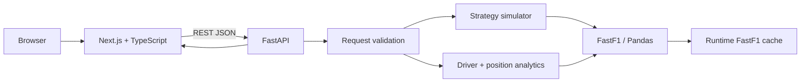

# Overtakr Architecture

## System overview



Overtakr is a monorepo with two independently deployable services. The split keeps browser/UI concerns separate from Python race-data processing while preserving one reviewable codebase.

## Frontend — `frontend/`

Primary technologies:

- Next.js 15
- React 19
- TypeScript
- Recharts
- Framer Motion
- Zod
- Tailwind CSS

Responsibilities:

- race/driver selection;
- strategy configuration;
- API requests and error presentation;
- result visualisation;
- scenario URL sharing.

The active App Router implementation lives in `frontend/app/`. Legacy duplicate `src/app` scaffolding was removed so there is one unambiguous application entry point.

## Backend — `backend/`

Primary technologies:

- FastAPI
- Pydantic v2
- Python
- Pandas
- FastF1

Modules:

- `main.py` — HTTP boundary, Pydantic validation and endpoint orchestration;
- `simulator.py` — deterministic strategy comparison logic;
- `fastf1_utils.py` — schedule/session loading, FastF1 cache configuration and race-context helpers;
- `tests/` — deterministic simulator and API-validation tests.

## Race-data loading

FastF1 owns disk caching under `FASTF1_CACHE_DIR` (default `backend/ff1cache`). The cache is runtime data and is excluded from Git.

`load_race_session` also uses a small four-session in-process LRU cache. This deliberately avoids retaining many large session objects in memory on a small cloud instance.

High-frequency car telemetry is disabled during `session.load()` because the current product uses laps, results, weather and track-status context rather than telemetry traces. This reduces download size, cache growth and memory pressure.

## Strategy request flow

1. User selects a season/race and defines one to six strategies.
2. Frontend POSTs a structured request to `/api/simulate`.
3. Pydantic validates driver code, compounds, profiles, numeric ranges, pit-lap syntax and unique strategy names.
4. FastF1 loads the race session (using disk/in-process caches when available).
5. The backend builds a race baseline from a selected driver or the field median.
6. Pit laps are checked against actual race distance.
7. The simulator computes per-lap strategy projections, stints and cumulative totals.
8. The API builds a leaderboard and pit-window ranking.
9. The frontend renders charts and summaries.

## Reliability and failure behavior

### Generated data stays out of Git

Large FastF1 cache databases and timing payloads are generated at runtime instead of being committed. This keeps clones small and avoids coupling the repository to one machine's cache state.

### Upstream failures

If FastF1 cannot load uncached data, the backend logs the original exception and returns a safe `502` message. Internal paths and raw exception details are not sent to browser users.

### Input validation

The API rejects duplicate strategy names before they can overwrite dictionary results. It also rejects malformed pit-lap syntax, pit stops beyond race distance and unavailable drivers.

### CORS

Allowed browser origins are environment-driven. Localhost defaults make a fresh local checkout work without extra configuration.

## Containers

`compose.yaml` runs the complete app:

- backend on port `8000`;
- frontend on port `3000`;
- named FastF1 cache volume;
- health checks;
- restart policies.

The frontend uses Next.js standalone output for a smaller runtime image. The backend container runs as a non-root user.

## CI

GitHub Actions verifies:

- backend dependency installation, pytest and Python compilation;
- frontend `npm ci`, lint, TypeScript checking and production build.

Tests intentionally avoid network-dependent race downloads.

## Deployment model

```text
Browser
  |
  v
Vercel / Next.js
  |
  v
Render or Fly.io / FastAPI
  |
  v
FastF1 upstream + runtime cache
```

See [`deployment.md`](./deployment.md).

## Remaining scaling choices

The current design is suitable for a portfolio/demo application and small deployments. If usage grows, the next meaningful changes would be:

- move slow race-session preparation to a job/cache layer;
- add request tracing and latency/error metrics;
- version/generate TypeScript API contracts from OpenAPI;
- split the large primary frontend page into domain components;
- add persistent scenario/user storage only if the product requires accounts.
